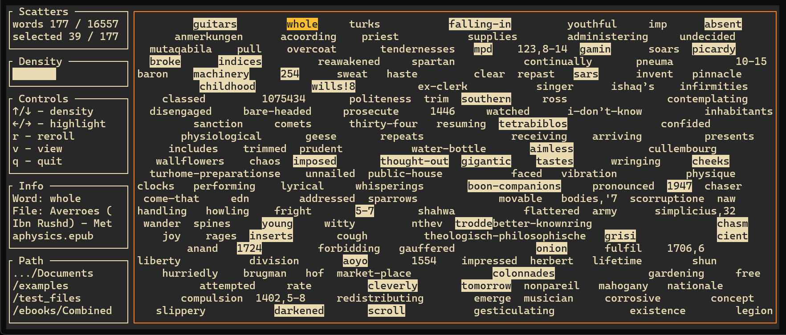

# Text Scatters

  <div align="center">
          
      <br>
          <i>Example run with gruvbox theme</i>
    <br>
  </div>

<br>

Text Scatters takes your text files (`.txt`, `.md`, `.epub`) and creates randomized word collages inspired by the cut-up technique. Navigate through scattered words with an interactive terminal UI.


## Installation

### From GitHub

```bash
# Install the latest version
cargo install --git https://github.com/jo56/scatters

# Install a specific release
cargo install --git https://github.com/jo56/scatters --tag v0.1.0

# Or clone and build locally
git clone https://github.com/jo56/scatters.git
cd scatters
cargo install --path .
```

## Usage

```bash
# Basic usage
text-scatters /path/to/text/files

# Use the last path (after running once)
text-scatters

# With a specific theme
text-scatters /path/to/text/files --theme rosepine
text-scatters -t nord  # Uses last path with nord theme
```

Text Scatters remembers the last directory you used, so after the first run, you can simply type `text-scatters` without a path argument. The last-used path is saved in your system's config directory (`~/.config/text-scatters/` on Linux/macOS, `%APPDATA%\text-scatters\` on Windows).

### Available Themes

- `monochrome` - Black and white (default)
- `softmono` - Black on pink-white (#FCF6F8)
- `lightmono` - Black designed for lighter terminals
- `redmono` - Black and red initially designed for lighter terminals (works with dark ones too)
- `nord` - Cool arctic palette ([Nord](https://www.nordtheme.com/) by Arctic Ice Studio)
- `nord-bg` - Nord theme with background fill (useful for lighter terminals)
- `gruvbox` - Retro warm colors ([Gruvbox](https://github.com/morhetz/gruvbox) by morhetz)
- `rosepine` - Soft purple and pink tones ([Rosé Pine](https://rosepinetheme.com/))
- `goldgreen-light` - Light gold and green styling
- `goldgreen-dark` - Dark gold and green styling

### Controls

- `↑/↓` - Adjust word density
- `←/→` - Navigate between words (highlights visited words)
- `Space` - Toggle current word highlight style (only on compatible themes)
- `r` - Reroll/regenerate the scatter
- `v` - Toggle full window collage
- `q` or `Ctrl+C` - Quit

## How It Works

1. **Parsing**: Text Scatters reads all text files from the specified directory
2. **Filtering**: Removes common stop words and keeps words 3+ characters long
3. **Generation**: Randomly places words across the terminal canvas
4. **Interaction**: Navigate and explore the scattered text with keyboard controls

The density control affects how many words appear on screen, and each reroll creates a new random arrangement from your word pool.

## Dependencies

Built with:
- [ratatui](https://github.com/ratatui/ratatui) - Terminal UI framework
- [crossterm](https://github.com/crossterm-rs/crossterm) - Cross-platform terminal manipulation
- [clap](https://github.com/clap-rs/clap) - Command line argument parsing
- [epub](https://github.com/danigm/epub-rs) - EPUB file parsing
- [pulldown-cmark](https://github.com/raphlinus/pulldown-cmark) - Markdown parsing

## License

This project is licensed under the MIT License.
